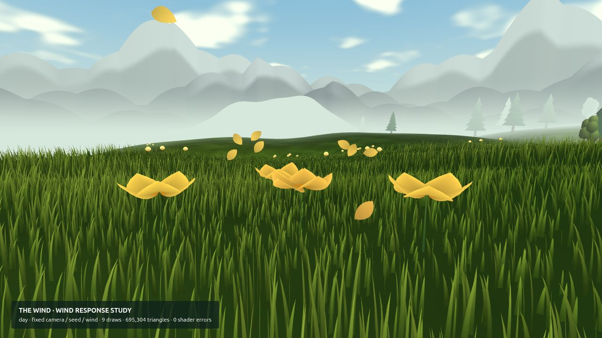
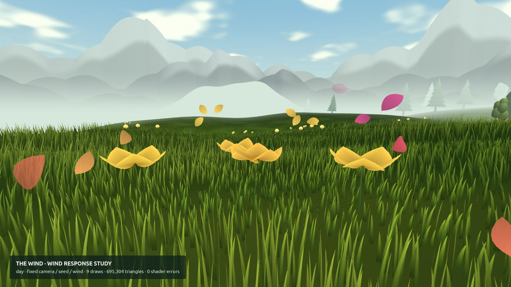
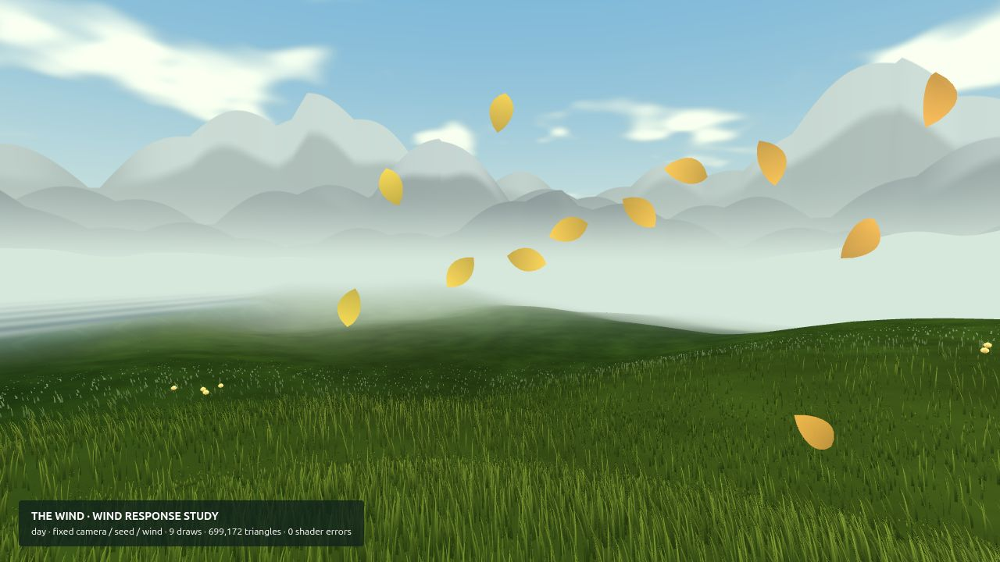
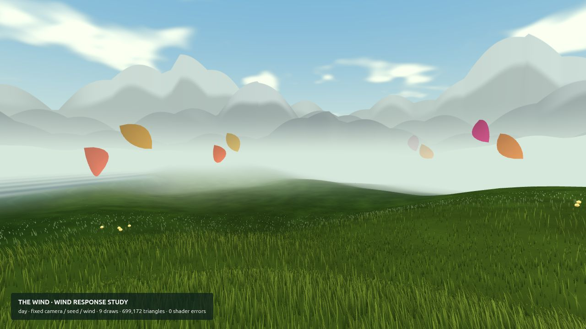
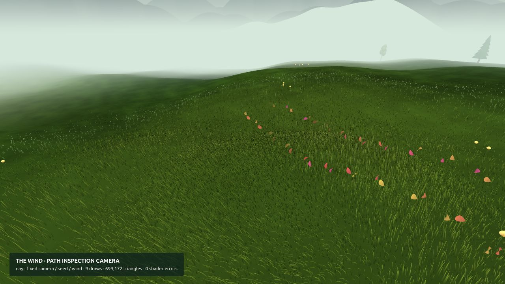

# Bloom response and petal flow — visual pass 2

An opening cluster now sends a short, warm wave through nearby grass. The grass
bends outward and settles over 2.6 seconds; a subtly greener patch remains around
opened flowers and returns when revisiting them. Nearby flowers opening together
share one wave, with at most four waves active globally.

Carried petals now follow distance-spaced samples of the player's recent route.
Their stream stretches with speed and curls through turns. A few petals lead at
the edges of the view; the rest follow the route behind. World-space cups tumble
consistently in both eyes, fade near the player and fade at the stream wrap.
The geometry remains capped at 90 carried petals. Flying petals now originate
at the taller flower heads introduced in pass 1.

## Matched screenshots

Before is `fff0bb2` (visual pass 1). These are actual 1280 × 720 browser renders
using the same scripted camera, seed and simulation sequence on both revisions.
`scripts/review-flow.html` sets up the views without modifying gameplay settings.
The 60° review camera is narrower than the ordinary 72° gameplay camera.

| Bloom — before | Bloom — after |
| --- | --- |
|  |  |

| Turning flight — before | Turning flight — after |
| --- | --- |
|  |  |

This additional **diagnostic side camera** shows the route history and stream.
It is not the normal player view:

## Reproduce and review

Run `npm run dev`, then open:

- `/scripts/review-flow.html?shot=ripple` — scripted first-cluster bloom.
- `/scripts/review-flow.html?shot=ripple&delay=3` — the wave has expired; colour remains.
- `/scripts/review-flow.html?shot=trail` — 70 starting petals and a scripted turning flight.
- `/scripts/review-flow.html?shot=trail-side` — the same flight from the diagnostic camera.
- Add `&time=night-full&quality=low` to check the night palette and low grass budget.

For the before images, use this review page with source revision `fff0bb2`.
The existing Pages workflow excludes the review tools and images from the game.
For motion review, play normally, skim the first clusters, then turn and gust;
look back at the trail in a headset. Check that the leading petals feel natural
and that the warm grass response is visible without being distracting.

## Cost and verification

Both matched scenes have the same draw and triangle counts before and after:
9 draws / 695,304 triangles for bloom; 9 draws / 699,172 triangles for flight.
The low grass budget flight view has 219,172 triangles. These are submitted
geometry counts, **not frame-time benchmarks**.

No additional meshes, draw calls, textures or dependencies. The existing clearing
texture's green channel stores lasting colour. Blooming adds texture updates only
on events; shader work is bounded by four waves and inactive waves are skipped.
The petal path uses 128 history positions and 12 GPU control points, with a reset
on long teleports. CPU path sampling and shader work increase despite unchanged
geometry counts.

Six new tests cover frame-rate-independent straight paths, turn history, finite
vertical/idle/reset behavior, petal budgets, merged/expiring waves, and restored
colour after returning to an opened patch. Existing tests remain passing.

Run `node --experimental-loader ./tests/three-loader.mjs --test tests/*.test.js`.
Desktop bloom, settled bloom, turning flight, side-view and low-budget night
scenes compile with zero shader errors. Actual Quest frame time and stereo comfort
remain unverified. PS4 quality remains the visual target; lighting and landscape
character are the next planned pass.
