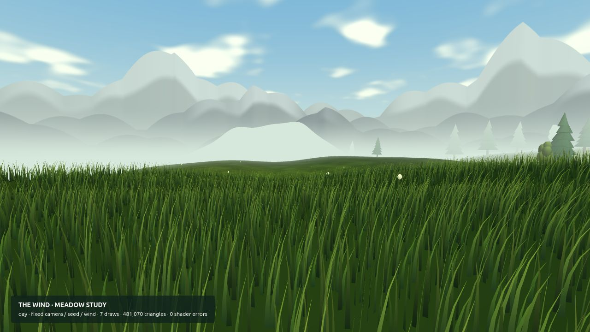
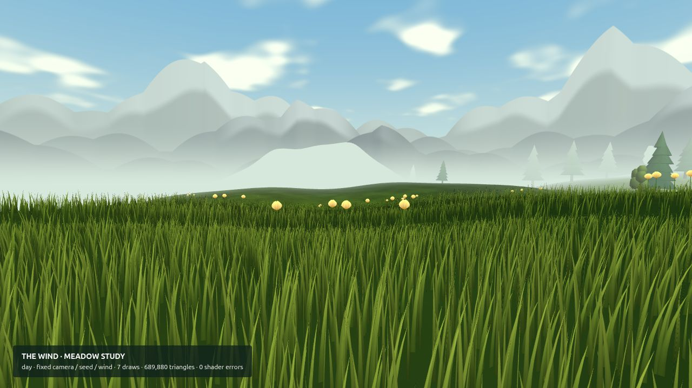
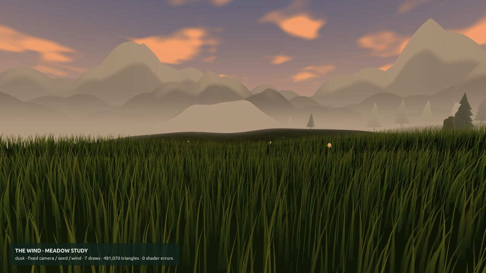
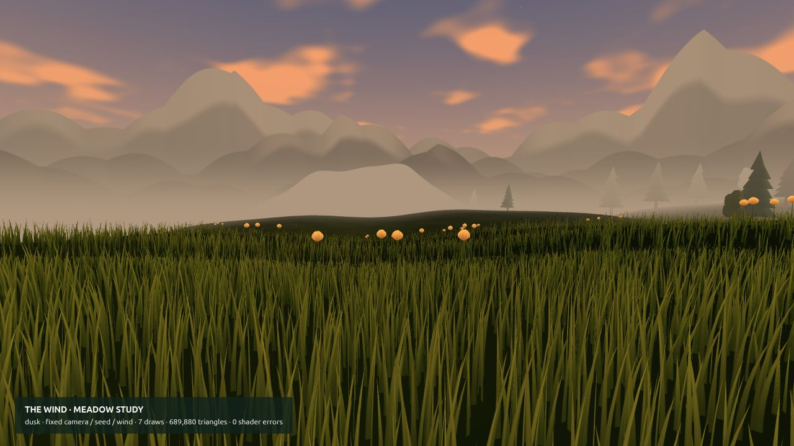
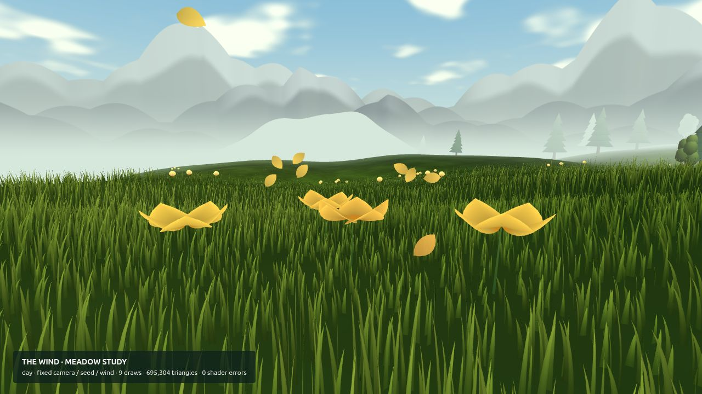
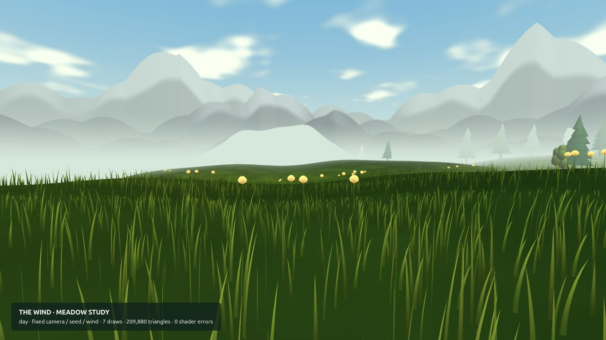

# Meadow composition — visual review, pass 1

The opening meadow now gives the eye a destination: taller warm buds in loose
clusters, with shorter grass around them and three patches along the initial
heading. Grass has more foreground coverage, varied height and colour, smoother
curvature, and softer face shading. Open flowers have broader cups and a warm
throat. This is the first meadow pass toward the requested PS4 visual target;
the later lighting, landscape, bloom-ripple and petal-trail passes are pending
visual feedback.

## Matched captures

These are actual browser renders, not concept images. Before is commit `47cdb99`
on `codex/landscape-refresh`. Both versions use the same 1280 × 720 viewport,
seed, 60° review camera and eight-second wind state, at the meadow's home point.
The ordinary game's camera remains 72°. No postprocessing was added for captures.

| Day — before | Day — after |
| --- | --- |
|  |  |

| Dusk — before | Dusk — after |
| --- | --- |
|  |  |

After collecting the first cluster, seen from closer up:

The low grass budget, rendered on desktop (not a headset capture):

## Cost and validation

- Matched day/dusk scene: **7 draw calls** before and after. Submitted triangles
  increase from **481,070 to 689,880**, mostly because blades have six segments
  instead of four. Grass instance caps remain unchanged.
- One new **64 KiB RGBA texture** describes flower clearings. It updates when the
  flower cell changes, and is sampled by grass and terrain vertex shaders.
- The low grass budget submits **209,880 triangles** in the same scene. This
  checks the existing 12,000-blade cap, not stereo performance or foveation.
- Day, dusk, opened flowers and low-budget scenes compile with zero shader errors.
- Normal gameplay collected petals through the introductory patches with no
  browser errors. Clustering changes where rewards are concentrated; the per-flower
  reward, trigger radius and bloom duration are unchanged.
- Automated tests cover stable patch identities, nearest-first budget selection,
  water/biome/edge exclusions, mask alignment after recentering, and preventing a
  second reward when revisiting a cluster. Existing woodland and wind tests pass.

Run `node --experimental-loader ./tests/three-loader.mjs --test tests/*.test.js`.
With `npm run dev`, open `/scripts/review.html`; add `?time=dusk`, `?shot=bloom`,
or `?quality=low` for the other views. The review page is excluded from the
published game by the existing Pages workflow. Before captures can be reproduced
by using this review page with the baseline source revision.

Actual Quest frame time, stereo comfort and the final PS4 visual comparison are
still unverified. Review the grass in motion for aliasing and the first patches
for collection pacing before merging.

## Feedback requested

1. Are the warm buds clear enough, and is their size appropriate?
2. Does the grass feel lush and soft enough, or should its shape be finer?
3. Are the opening flower patches too directed, or a useful invitation to explore?
